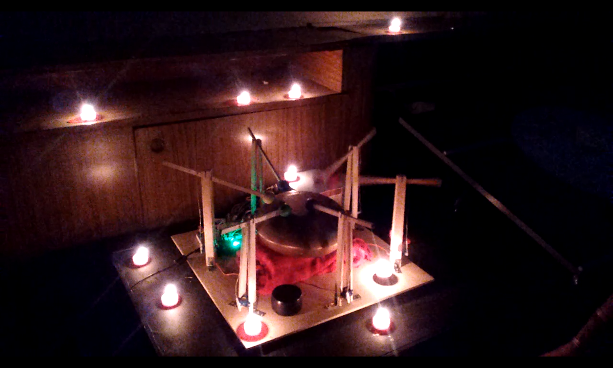

# sattvot
## Musical robot built with Arduino + Servo + Sattva drum

This project is a generative robotic percussion system built with Arduino and six servo motors. Each servo controls an individual striker that hits a Sattva Drum, creating evolving rhythmic patterns through randomized behavior.

The algorithm continuously generates new combinations of active percussion arms using pseudo-random values. During each cycle, selected servos perform a full movement sequence between rest and strike positions, producing dynamic and non-repetitive rhythms. A push button can force all percussion channels to activate simultaneously, creating synchronized rhythmic accents.

The result is a mechanical music instrument capable of autonomous generative performance, combining robotics, physical computing, and algorithmic composition.

